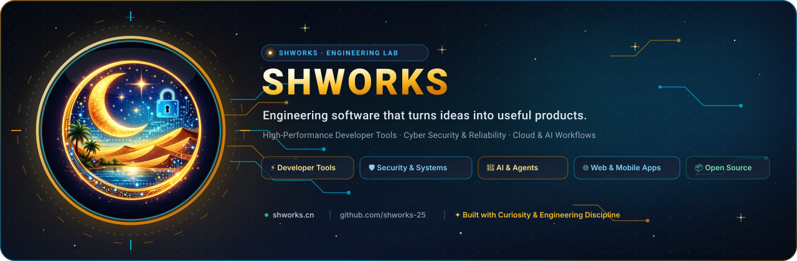

<div align="center">

<a href="https://shworks.cn">
  
</a>

<br />

# SHWORKS (`.github`)

**Official repository containing the GitHub organization profile, workflow automation, and brand assets for [shworks-25](https://github.com/shworks-25).**

[Website](https://shworks.cn) · [Organization Profile](./profile/README.md) · [GitHub](https://github.com/shworks-25)

</div>

---

## 📁 Repository Structure

```text
.
├── .github/
│   └── workflows/
│       └── update-profile.yml    # Daily GitHub Action to sync organization activity
├── profile/
│   ├── README.md                 # Public Organization Profile displayed on github.com/shworks-25
│   ├── banner.svg                # High-definition vector organization banner
│   ├── logo.png                  # Master brand emblem
│   └── metrics.svg               # Rolling 365-day commit heatmap & engineering pulse
├── scripts/
│   ├── generate-banner.js        # Script to render vector banner with brand styling
│   └── update-metrics.js         # Generator for real-time engineering metrics
└── README.md                     # Repository documentation
```

---

<div align="center">
  <sub>© SHWORKS Engineering Lab · Built with curiosity, engineering discipline, and continuous iteration.</sub>
</div>
